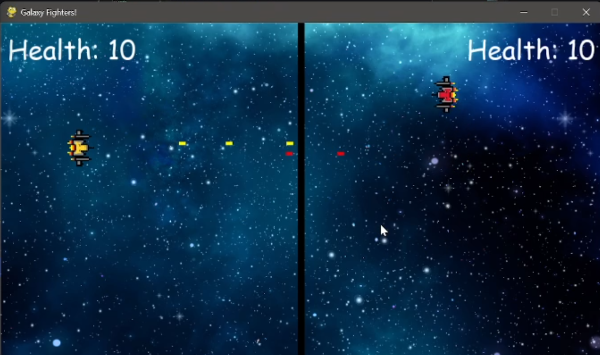
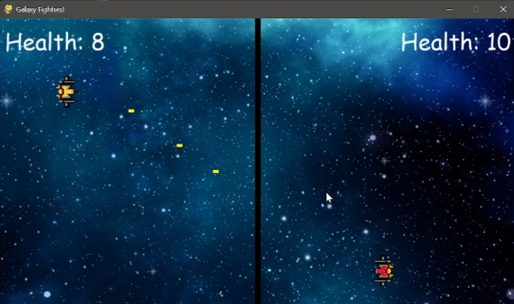
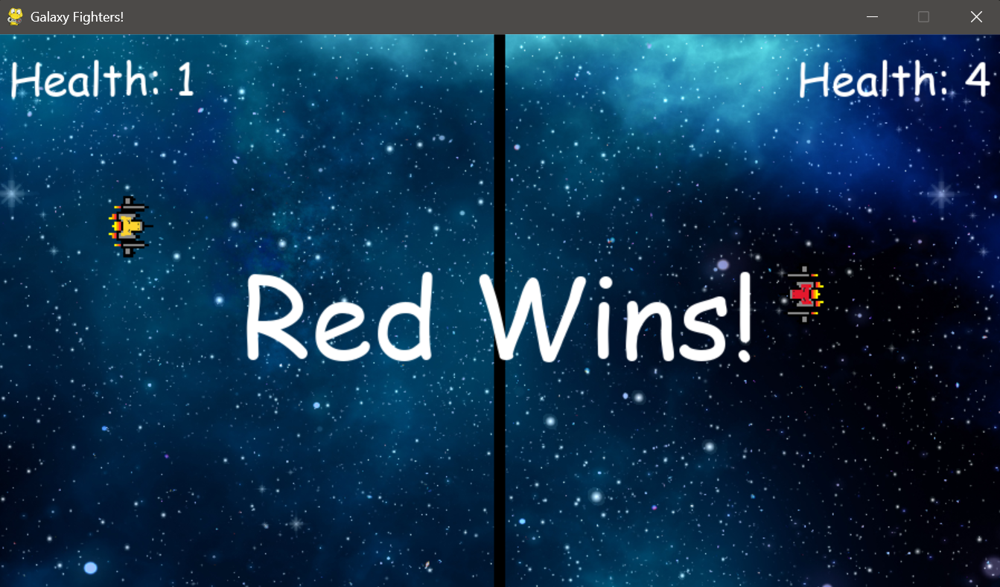
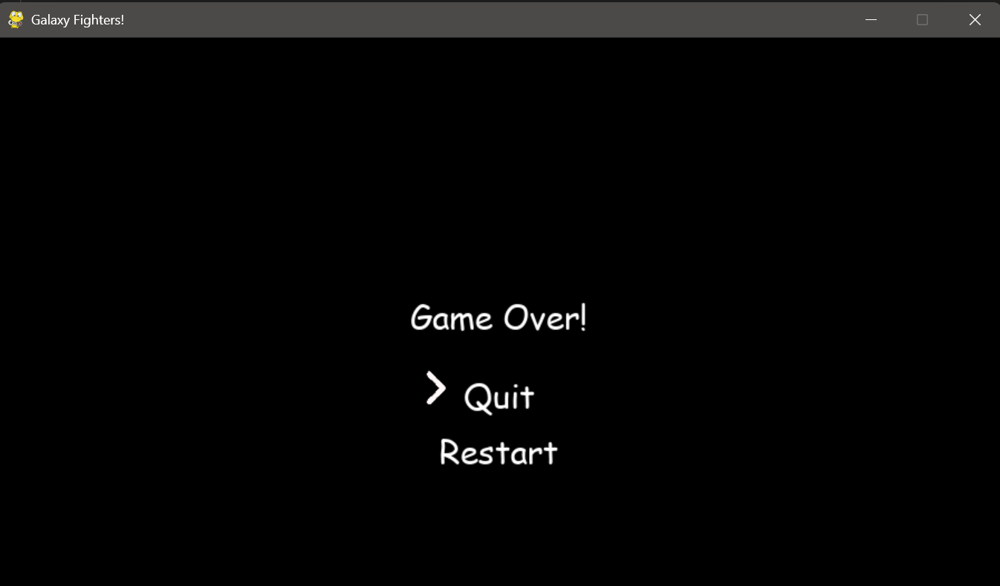

# Galaxy Fighters!

## Description
**Galaxy Fighters!** is a fun-to-play, fast-paced **2-player game** where players take control of spaceships and battle it out for victory. The game features cool sound effects, a dynamic user interface, and an exciting gameplay loop that keeps players engaged.

The game is designed for **two players**, but in future versions, there will be a **single-player mode** where you can challenge an AI-powered computer bot. Additionally, a toggle button for sound control is planned for future updates.

---

## Features
- **Two-player battle**: Control your spaceship to outmaneuver and shoot your opponent.
- **Dynamic sound effects**:
  - Shooting and bullet hits.
  - Winner music.
  - Background music (BGM) during gameplay.
  - Menu selection sound effects.
- **Health-based gameplay**: Players must keep their spaceship's health above zero to survive.
- **Game Over Menu**: 
  - Choose to quit or restart the game.
- **Interactive environment**: Smooth controls and visually appealing graphics.

---

## Controls
### Player 1 (Yellow Spaceship):
- **W**: Move up.
- **A**: Move left.
- **S**: Move down.
- **D**: Move right.
- **Left Ctrl**: Shoot bullets.

### Player 2 (Red Spaceship):
- **Arrow keys**: Move up, down, left, and right.
- **Right Ctrl**: Shoot bullets.

---

## How to Play
1. Launch the game by running the `main.py` file.
2. Each player controls their spaceship and must try to reduce their opponent's health to zero by firing bullets.
3. Health is displayed at the top of the screen.
4. The game ends when one player's health reaches zero.
5. In the **Game Over Menu**, select **Restart** to play again or **Quit** to exit the game.

---

## Requirements
### Python Libraries:
- `pygame`  
Install all required dependencies using the following command:  
```bash
pip install pygame
```

---

## How to Run
1. Clone or download this repository.
2. Make sure the `assets/` folder contains all necessary images and sound files.
3. Run the game using:
   ```bash
   python main.py
   ```
4. Enjoy the game!


---

## Future Features
- **Single-player mode**: Play against an AI-powered bot.
- **Sound toggle**: Add an option to turn sound on/off during gameplay.
- **Enhanced UI**: Improve menu design and include additional game settings.


---

## Screenshots

### Gameplay





### Game Over





---

## License
This project is free to use for fun and educational purposes. Feel free to modify it and add your own features!

---

Enjoy the game! 🚀