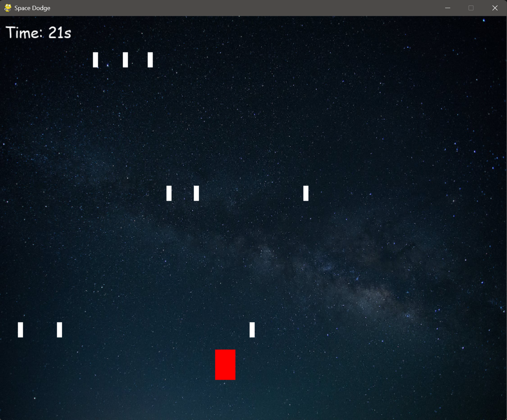
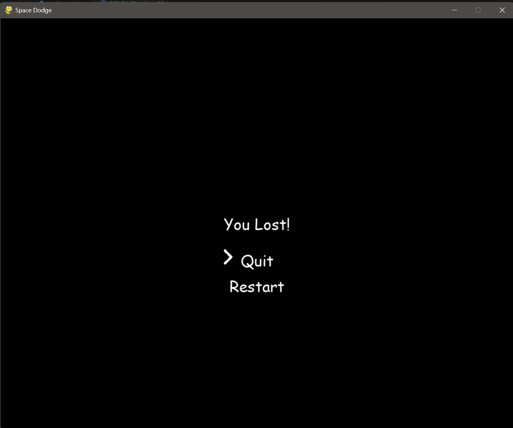

# Space Dodge

**Space Dodge** is a simple arcade-style game developed using **Pygame**. In this game, you control a red spaceship (player) and your goal is to dodge falling stars while trying to stay alive for as long as possible. The game gets progressively harder as time passes by, with stars falling faster and more frequently.

## Gameplay

- **Objective**: Dodge the falling stars as long as you can.
- **Controls**: 
  - Use the **left** and **right** arrow keys to move the spaceship.
  - The spaceship is represented by a red rectangle at the bottom of the screen.
  - Avoid collisions with falling white stars. If a star hits the spaceship, you lose!

## Features

- **Increasing difficulty**: Stars fall at increasing speed as time passes.
- **Game Over Screen**: When you lose, you are presented with options to either quit or restart the game.
- **Smooth Controls**: Responsive and easy-to-use controls.

## Installation

### Requirements

- Python 3.x
- Pygame library

### How to Run

1. Clone or download this repository.
2. Install Pygame using the following command:
   ```bash
   pip install pygame
   ```
3. Run the `main.py` script to start the game:
   ```bash
   python main.py
   ```

## Screenshots

### Gameplay


### Game Over / Losing Screen

