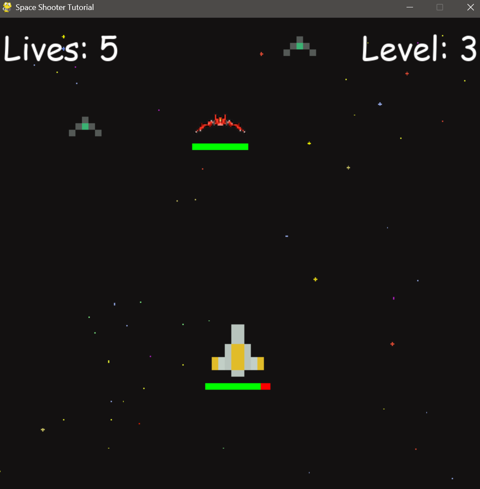

# Space Invader

## Overview
Space Invader is a classic arcade-style shooting game that brings back the nostalgia of childhood gaming. With pixel art graphics and engaging gameplay, players can enjoy a retro experience while battling waves of enemies and a challenging boss.

## Features
- **Pixel Art Style**: Enjoy beautifully crafted pixel graphics that evoke the charm of classic arcade games.
- **Multiple Enemy Types**: Face off against various enemy ships, each with unique behaviors and attack patterns.
- **Boss Battles**: Test your skills against a formidable boss that appears at higher levels.
- **Powerful Lasers**: Shoot lasers to destroy enemies and avoid their attacks.
- **Health Bar**: Keep track of your health and the health of the boss with visual health bars.
- **Sound Effects**: Immerse yourself in the game with background music and sound effects for shooting, enemy destruction, and game events.

## Installation
To run the game, follow these steps:

1. **Clone the Repository**:
   ```bash
   git clone https://github.com/CKShetty4/Python-Games-with-Pygame.git
   cd '.\Python-Games-with-Pygame\Space Invaders\'
   ```

2. **Install Pygame**:
   Make sure you have Python installed on your machine. Then, install Pygame using pip:
   ```bash
   pip install pygame
   ```

3. **Add Assets**:
   Ensure that you have the required asset files in the `assets` directory. This includes:
   - Ship images (e.g., `pixel_ship_red_small.png`, `pixel_ship_green_small.png`, etc.)
   - Laser images (e.g., `pixel_laser_red.png`, `pixel_laser_green.png`, etc.)
   - Background image (e.g., `background-black.png`)
   - Sound files (e.g., `BGM.mp3`, `blast.mp3`, `BossLaser.mp3`, etc.)

## How to Play
1. **Start the Game**: Run the game by executing the following command in your terminal:
   ```bash
   python main.py
   ```

2. **Controls**:
   - **Move Left**: `A` or `Left Arrow`
   - **Move Right**: `D` or `Right Arrow`
   - **Move Up**: `W` or `Up Arrow`
   - **Move Down**: `S` or `Down Arrow`
   - **Shoot**: `Spacebar`

3. **Objective**: Destroy all enemy ships while avoiding their attacks. Survive through multiple levels and defeat the boss     to win the game.

4. **Game Over**: If your health reaches zero or you lose all your lives, the game will end. You can restart the game by clicking the mouse.

## Screenshots

### Gameplay





### Game Over / Losing Screen


## Contributing
Contributions are welcome! If you have suggestions or improvements, feel free to create a pull request.

## License
This project is licensed under the MIT License. See the LICENSE file for more details.

Enjoy the game and relive the nostalgia of classic arcade shooting!
